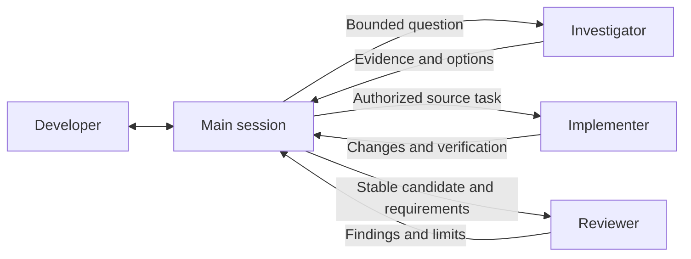

# Subagent design: three roles, explicit assignments

Status: **implemented and validated**, revision 1, September 7, 2026.
Branch: `codex/subagent-design`, based on `2db0e58`.
The user accepted this design for implementation. The source distribution now
implements the three-role surface. See [validation evidence](subagent-experiments.md)
for fresh Codex results, capability limits and installed-hub rollout.

## The experience we want

Piper should keep the developer's intent, design conversation, decisions and
unfinished work coherent as a project grows. Subagents contribute bounded work
to that conversation. The main session remains responsible for synthesis,
questions that need the developer, shared records and acceptance.

The design keeps three reusable roles: **investigator, implementer and
reviewer**. Architecture, security, documentation research and test design become
explicit focuses within assignments. A role can have several instances when
separate questions justify them; a task can use none.

For the developer, the visible behavior should be simple:

- A small understood fix proceeds in the main session.
- An unresolved question can go to an investigator while the main session works
  on another useful part of the problem.
- Authorized independent implementation can use separate source workers.
- A required independent review examines the actual result before acceptance.

The developer should not have to select from seven job titles, manage a worker
roster, or repeat an existing delegation grant. Piper explains the useful split
and returns a coherent result, including unresolved questions.

The main session owns hub publication, candidate assembly and source integration.
Source remains in the project's repository and assigned worktrees. A worker's
completion report is evidence for the main session to examine.

## What the existing system tells us

The [completed experiments](codex-prototype-experiments.md) support keeping
bounded source workers, independent review, isolated checkouts and durable
parent continuity. In the Mason replay, worker tests passed before review and
coordinator inspection exposed four defects. The final combined candidate
passed 287 tests; a fresh session later reconciled completed publication with
a stale pause packet. These results do not validate all seven custom roles or
establish that delegation is always faster than working in one session.

Three weaknesses in the seven-role baseline motivated this design:

1. Baseline brainstorm asked the architect to generate
   design options, while the former `architect` brief
   restricted it to architecture review. Investigation also too readily called
   for both architecture and documentation helpers.
2. The former `verifier` refused checks
   requiring writable state. Ordinary test fixtures, caches and build outputs
   can require writes without changing the implementation being examined.
3. Seven installed configurations are not seven demonstrated native role
   activations. The tested client exposes a spawn API without a role selector;
   explicit role instructions worked, but native role overlays and their
   permission narrowing remain unverified. See [current capability evidence](capability-matrix.md).

## Three roles and their boundaries

| Role | Question it owns | Useful return | Authority it does not receive |
| --- | --- | --- | --- |
| Investigator | What is true, possible, or still unknown about this bounded question? | Source-grounded explanation, credible options, tradeoffs, references, uncertainties and the decision they inform. | Product acceptance, project-source edits, shared-record publication or an implementation handoff. |
| Implementer | Can this accepted, bounded change be completed in the assigned checkout? | Actual diff/commit, meaningful verification, changed assumptions, unresolved findings and dirty state. | Wider product decisions, another writer's checkout, hub records, base integration or further delegation. |
| Reviewer | Does this specific proposal or implementation meet its stated intent, and where could it fail? | Concrete findings, counterexamples, evidence, severity and verification limits. No finding quota. | Repairing the reviewed implementation, accepting the result, changing records or integrating source. |

An investigator can explore alternatives without an accepted implementation
direction. A reviewer can challenge a provisional design without authorizing
execution. Implementation still requires a formalized execution boundary and
the accepted design revision when the work comes from a studio.

There is no separate planner or coordinator agent. The main session holds the
ongoing conversation. A worker can recommend a next step; the main session
decides how that recommendation affects the current work and the user's choices.

### Where the current roles go

| Current role | Proposed treatment |
| --- | --- |
| `architect` | Investigator for options and system understanding; reviewer for challenging a specific architecture. |
| `docs_researcher` | Investigator with a documentation or prior-art question and appropriate sources/tools. |
| `implementer` | Retain; strengthen the shared assignment and return rules. |
| `reviewer` | Retain; distinguish design review from implementation review in the assignment. |
| `security_reviewer` | Reviewer with an explicit threat model, security boundary and relevant project guidance. |
| `tester` | Implementer restricted to assigned tests/fixtures when independent test authorship is useful. |
| `verifier` | Existing verification procedure, usually run directly. Delegate failure investigation or substantial evidence analysis when that needs an agent. |

Security and architecture remain explicit work. Removing a title must not remove
their questions from review. A security-focused reviewer receives the relevant
assets, trust boundaries, attacker capabilities and acceptance concerns; a
generic instruction to "also consider security" is insufficient for that task.

The same model can perform these different jobs. A role supplies responsibility
and constraints, not extra expertise by virtue of its name. Preserve the user's
model and reasoning choices; introduce specialized configuration only after a
task demonstrates the need for different tools or capabilities.

## When to delegate

Before launching a helper, the main session identifies a bounded question or
contribution, explains why a separate context or independent judgment helps,
and checks dependencies and authorization. Required independent review is itself
a reason to use a separate context. Mere task size, a long-running command, or
the presence of an installed role is not sufficient.

| Situation | Proposed default |
| --- | --- |
| A quick lookup or understood small fix | Work directly; no role-selection ceremony. |
| Substantial code/documentation investigation with a distinct question | Use an investigator when it isolates noisy work or enables useful parallel progress. |
| Two tightly coupled changes with unsettled interfaces | Resolve the interface first, or sequence the work. |
| Independent implementation tasks with an existing delegation grant | Prepare isolated assignments and delegate the useful split. |
| Authorized implementation without a delegation grant | The main session implements. Do not introduce a new permission question merely to optimize its own workflow. |
| Existing required review gate | Use an independent reviewer; keep the current scope/impact gates. |
| A known test command taking several minutes | Run the command through the available execution tools. An extra LLM is useful only if there is substantial analysis or independent judgment to perform. |

Read-focused delegation follows explicit user requests or applicable Piper
instructions. Writable delegation continues to require a user grant covering
delegation and the current execution scope. A standing instruction such as
"use agents for independent implementation in this project" is sufficient within
that scope; do not ask separately for every worker. A design discussion grants
neither source-edit authority nor implementation delegation.

Honor native concurrency limits. Start only work with useful independence;
reserve the main session for synthesis, interface decisions and integration.
Do not create a persistent worker queue to keep every slot occupied. A helper
does not recursively delegate; the main session owns any additional split.

## Assignments and returned evidence

Use concise natural-language assignments. These are required facts, not a new
form for the developer or a new JSON artifact for every worker.

Every assignment states:

- The bounded question or outcome, relevant phase, and why this helper is useful.
- The source of intent: relevant request, accepted constraints and canonical
  design references. Identify what is fixed and what the worker may decide.
- The project and source to inspect, including exact base/candidate identities
  for implementation review. Identify whether observations concern a moving
  working tree or a stable revision.
- The allowed actions, prohibited changes, relevant tools and expected output.
- What uncertainty or dependency should cause it to report back before continuing.

A source-writing assignment additionally names its exclusive checkout/branch,
owned files or area, starting state, verification expectations and whether the
worker should commit. Missing ownership or access prevents writes; an inherited
working directory is never a fallback assignment.

The worker usually runs outside the hub. The parent supplies the absolute hub
and project-record locations, or the relevant extracted context when direct
access is unavailable. A role must not assume that `STATION.md` exists in its
source checkout. The worker follows project source instructions and its delegated
assignment; it does not restart hub registration, ask the developer to select a
project, or create an independent execution lane as part of worker startup.

For independent review, provide requirements, relevant decisions, exact source
and verification evidence. Prefer a fresh context when the native tool supports
it. Avoid copying the author's entire reasoning history into the review prompt;
retain the context needed to judge intent fairly. Ask what fails rather than
asking the reviewer to confirm a preferred conclusion.

Returned results distinguish completion, a partial result, a blocked dependency
and a question requiring a decision. Include actual evidence locators, relevant
commands/results, uncertainty, unexpected changes and any remaining running
processes. An implementer also reports its final source identity and dirty state.
Do not claim a clean checkout or a passed test that was not observed.

The main session checks the actual contribution. It validates review findings
using the existing in-scope/out-of-scope/false-positive verdicts, resolves shared
assumptions, assembles changes and verifies the combination. Worker-local passes
and a conflict-free Git merge do not establish combined correctness.

## Verification and permission boundaries

Separate permission to change project inputs from permission to execute a check
that produces disposable output. "Read-only review" means preserving the source,
accepted artifacts and records under review; it does not imply that every test
can execute without temporary files.

| Surface/action | Investigator and reviewer | Implementer |
| --- | --- | --- |
| Project source, tracked tests and canonical design | Observe only. | Edit only assigned source/test paths within accepted scope. |
| Live hub records and active runtime configuration | Observe relevant context; no publication or edits. | Same. |
| Existing checks and disposable probes | Only when appropriate to the assignment and permitted by actual runtime access; declare expected scratch/build outputs. | Same, plus assigned test authoring. |
| Snapshots/goldens, dependencies, external systems | No implicit update, installation or external authority. | No implicit authority; report what is required. |
| Source commits and integration | No commits or integration. | Commit assigned work when authorized; never integrate base. |

Project configuration can itself be the assigned implementation deliverable,
including Piper's source templates. That does not authorize changing the active
worker's permissions, instructions or installed hub to bypass its assignment.

Keep native read-only narrowing for observer roles where the client can actually
apply it. If needed scratch writes are unavailable, do not drop the restriction
or rewrite managed configuration to get a test to run. The main session can run
the check under its existing authority and return the exact evidence for review,
or prepare a permitted disposable validation environment. A check the reviewer
could not run independently is reported as such.

Prefer isolated validation worktrees when checks may write within a repository.
Pin the examined revision and inspect the resulting source state. Snapshot
updates, modified tracked inputs or unexplained writes invalidate a claimed
unchanged-candidate check; preserve the evidence and report it to the parent.
Do not silently reset files to conceal a test side effect.

This changes the verifier's blanket prohibition without promising arbitrary
write access to a reviewer. Native permissions remain an upper bound on every
assignment. If a task specifically requires enforced separation and that cannot
be established, a behavioral promise is not a substitute.

## Making activation observable

Codex supports project custom-agent files and delegation requested by applicable
instructions. Configuration is inherited subject to native rules; installing a
role definition alone does not show which instructions or permissions a specific
worker received. Current guidance was checked on September 7, 2026 against the
[official subagent documentation](https://learn.chatgpt.com/docs/agent-configuration/subagents).

Piper uses the native spawn tool actually available in the session:

1. Identify available delegation, role-selection and context controls once when
   needed, and again when the client/context changes. Do not run a diagnostic
   ceremony before every small task.
2. If named role selection is supported, select the relevant installed role
   through that supported interface. Do not assume a particular parameter name.
3. Otherwise, supply the installed role's behavioral brief and the shared
   assignment boundaries explicitly in the spawn message. Naming an agent
   "reviewer" does not by itself apply a role configuration.
4. Observe the worker's actual result and available runtime metadata. If native
   permissions cannot be established, record that uncertainty. A worker repeating
   its role name proves neither configuration loading nor sandbox enforcement.

For a meaningful delegated run, the existing parent ledger can record role,
actual dispatch method, applicable brief identity, observed permission limits
and result evidence. No new capability registry or per-worker ledger is required.

| Claim | Required evidence |
| --- | --- |
| Role installed | Rendered file/config checks and the actual installed hub surface. |
| Role instructions supplied | Native selection metadata where available, or the explicit dispatched brief and assignment. |
| Delegation effective for this task | Actual returned work meeting the assignment, examined by the parent. |
| Permissions enforced | Runtime evidence and bounded permission probes in disposable fixtures; a TOML declaration or compliant behavior alone is insufficient. |

If the native delegation tool is unavailable, the main session handles optional
work directly and reports a material limitation when relevant. A required
independent review remains outstanding; self-review cannot silently satisfy it.
Continue independent authorized work while that dependency is resolved.

## What this looks like on real work

### lc_factory: a small startup-summary fix

The main session traces producer and consumer, reproduces the multiline error,
fixes it and runs focused verification. It records one completion entry. There
is no investigator, tester or verifier launched simply because those activities
occur. Apply the existing proportional review rule to the actual change.

### Piper: exploring how delegation should work

The developer asks whether independent design sessions should share conclusions.
The main session keeps the product discussion and asks an investigator to trace
the current discovery/publication paths and identify where assumptions can become
stale. It can separately investigate native client capabilities if that is a
substantial independent question. It does not automatically request both.

The investigator returns evidence and options. When a particular design needs
pressure testing, a reviewer challenges that proposal's failure and recovery
cases. Neither helper accepts the design or creates an execution group. The
main session discusses the resulting choice with the developer.

### Mason: two implementation concerns with shared acceptance

After the bounded direction and delegation are authorized, two implementer
instances receive restore and runner assignments in separate worktrees. The
main session owns their interface, combined regression and candidate assembly.
A reviewer examines the exact combined candidate, including error precedence,
native interruption and interrupted restoration.

If the reviewer reproduces a late signal being masked, the main session validates
the finding and routes a repair to the owning worker. The reviewer does not
repair its own finding. A second reviewer with a security or failure-recovery
focus is useful only when that is a distinct substantive question. After repair,
the main session verifies affected behavior and the combined acceptance boundary.

### Piper bootstrap: tests, inspection and security

A change to installation paths needs a threat model covering symlinks, managed
files, hub-owned records and Git metadata. An independently assigned implementer
can write adversarial tests against the accepted ownership rules while another
worker changes distinct production files. If those tasks need a shared unsettled
interface, sequence them instead.

Use a reviewer with that explicit security focus. Run routine test commands
directly. Delegate failure triage only if the output needs substantial analysis.
The work receives security review and independent test design without making
"security reviewer", "tester" and "verifier" compulsory workflow stages.

## Conflicts, interruption and continuity

Keep the existing [coordinated-work procedure](../core/skills/piper-workflow/references/coordinated-work.md)
and integration protections. A role simplification does not relax ownership.

| Event | Main-session response |
| --- | --- |
| A worker needs another worker's file | Resolve ownership or sequence that edit; do not permit concurrent writes to the same checkout. |
| File-disjoint work conflicts on behavior | Identify the relied-on contract and one resolution owner; pause affected work and continue independent work. |
| Review findings disagree | Inspect evidence and reproduce the disagreement; do not use a vote or ask for more agents until someone agrees. |
| A worker times out or a session resumes | Query native status when available and inspect retained work; timeout is not completion and a saved handle is not liveness. |
| A worker stops with partial changes/processes | Retain its assignment and evidence; resolve active processes and ownership before replacement. |
| Publication happened before the checkpoint | Inspect actual source and reconcile records; do not repeat integration from the old packet. |

Short-lived workers do not acquire durable lanes. Persist only unresolved
assignments and the context needed to continue them in the parent's existing
records. Keep material decisions and acceptance evidence; do not archive every
worker transcript. A resolved research question may need only a concise finding
and source link in the parent design.

## Source changes and rollout

This document records the accepted design. Runtime procedures stay in the
existing ownership model:

| Source | Implementation |
| --- | --- |
| `core/shared/STATION.md` | Canonical role responsibilities, authorization boundaries and review/continuity rules. |
| `core/skills/brainstorm/` and `core/skills/design-studio/` | Conditional investigation and proposal challenge; remove the architecture-review/exploration contradiction. |
| `core/skills/piper-workflow/references/coordinated-work.md` | Common assignment, dispatch, return and recovery procedure, usable by relevant skills without changing phase merely by reading it. |
| `core/commands/ralph.md` and `core/skills/review/` | Direct verification by default, independent review and explicit scratch-write boundaries. |
| `adapters/codex/.codex/agents/` | Three concise native role definitions; remove retired definitions after migration checks. |
| `adapters/codex/.codex/config.toml` and `adapters/codex/AGENTS.md` | Matching role declarations and a short dispatch summary; preserve inherited user settings. |
| Renderer/distribution checks and user documentation | Verify the new surface, remove seven-role assumptions and describe observed capability accurately. |

Core owns shared behavioral rules. Adapter briefs summarize the role-specific
job and point to those rules; they must not become another full copy of the
workflow. The explicit fallback assignment carries the relevant common boundaries
as well as the selected brief, so it does not depend on hidden configuration.

First validate a rendered candidate in disposable hubs. Refresh an installed hub
only within the authorized rollout scope at a coordinated idle boundary:
affected sessions have checkpointed and no active worker depends on the old
managed instructions. A saved checkpoint alone does not establish that state.
Bootstrap can remove retired managed role files. Preserve all `projects/`
records and source workspaces.

Historical packets may refer to an old role or worker handle. Read those as
historical assignments using the mapping above; do not rewrite history or assume
the worker has disappeared because a role file was retired. Reassignment uses
current roles only after checking actual ownership. Keeping seven permanent
aliases would undermine the simplification; a documented migration mapping is
preferred unless compatibility evidence shows a real need for aliases.

## Validation before claiming the new design works

The seven-role experiments are baseline evidence. The following checks are
acceptance criteria. See the [implementation evidence](subagent-experiments.md)
for completed cases and the limits of current coverage:

| Case | Evidence required |
| --- | --- |
| Small-work control | Complete the lc_factory-style bounded fix without unnecessary workers or extra records. |
| Open investigation | From an unresolved Piper design question, return source-grounded options and uncertainties without prematurely accepting a design or editing project source. |
| Three-role dispatch | Exercise each role in fresh Codex runs; capture whether selection was native or supplied as an explicit brief. Do not infer use from file existence. |
| Worker startup outside the hub | The worker resolves its supplied context and assigned checkout without repeating registration, phase entry or project selection. |
| Observer permissions | Distinguish source preservation, scratch writes and native enforcement with disposable fixtures. Unsupported narrowing is reported accurately. |
| Test execution | A meaningful check using temporary fixtures runs where permitted; forbidden snapshot/source updates do not masquerade as verification. |
| Coordinated implementation and review | Two bounded workers, parent assembly and an independent review expose and resolve a real interaction defect at exact source revisions. |
| Context and failure | Missing assignment, stale contracts, interrupted workers and stale publication records preserve authority and resumability; no blind writer restart. |
| Upgrade | Retired managed roles disappear, current roles load, and existing project records, retained assignments and source remain intact. |

Run the repository's required checks after implementation and rendering. Native
experiments must record their actual client/version, dispatch method, permissions,
input revisions, evaluator steering, results and unresolved limits. If native role
selection is unavailable, a successful explicit-brief run supports that fallback
only. Do not present it as proof of a native role overlay.

Judge usefulness by decision quality, defects found, correctness, preserved
context, user intervention and artifact cost. Count avoidable launches and wait
time; fewer role definitions alone do not establish lower runtime cost.

## Accepted choices

The accepted design makes four choices:

1. Three reusable roles, with focused assignments and optional separate instances.
2. Preserve explicit authorization for writable delegation, honoring standing
   grants; conditional read-focused help and existing independent review gates.
3. Preserve observer inputs while allowing bounded, actually permitted test
   output; remove the dedicated verifier role.
4. Keep the main conversation responsible for product intent, shared records,
   conflict resolution and final acceptance.

The main tradeoff is less specialist discoverability in exchange for a clearer
set of responsibilities. Compensate with concrete assignment examples and
explicit security/architecture questions, not another hidden catalog of required
personas. Retaining seven thin roles is a reasonable alternative only if tests
show that their names reliably improve selection or results. A single generic
worker is simpler to configure, but makes independent challenge and source-write
authority too easy to blur. The three-role split preserves those
distinctions while leaving the workload-specific expertise in the assignment.
